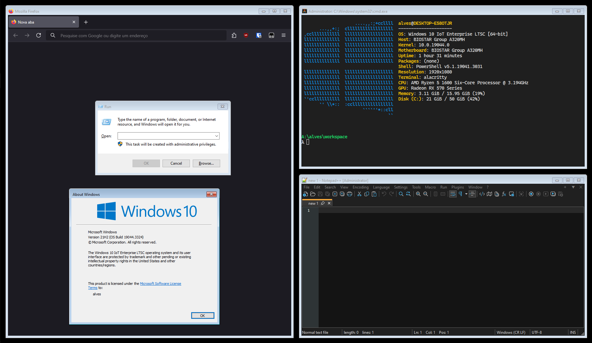

# BasicThemer

A lightweight and secure approach to using Aero Basic theme on modern Windows versions. This is a rewrite of basicthemer6, optimized for performance and security.



## Features

- **Lightweight**: Minimal CPU and memory usage
- **Safe Process Detection**: Automatically stops when blacklisted processes are running (blacklist.txt)
- **Clean Exit**: Restores all window states when closing

## Installation

### Pre-compiled Binary
1. Download the latest release from the [releases page](../../releases)
2. Extract the files to your desired location
3. (Optional) Modify `blacklist.txt` to customize process detection

### Building from Source

#### Prerequisites
- MinGW-w64 (GCC) for Windows
- Git (optional, for cloning)

#### Build Steps
1. Clone or download this repository
2. Open command prompt in the project directory
3. Run `build.cmd`
4. Find the compiled binary in `.\out\basicthemer.exe`

## Usage

1. Run `basicthemer.exe`
2. The program will automatically:
   - Monitor for blacklisted processes
   - Apply Aero Basic theme when safe
   - Restore original window states on exit

### Customizing Blacklist

Edit `blacklist.txt` to add or remove processes that should stop the theming:
```txt
BEService.exe
EasyAntiCheat.exe
VALORANT.exe
BattlEye.exe
```

### Terminating the Program

- Press Ctrl+C in the console
- Close the console window
- The program will automatically restore all window states

## Contributing

Feel free to:
- Report issues
- Submit pull requests
- Suggest improvements
- Share your modifications
